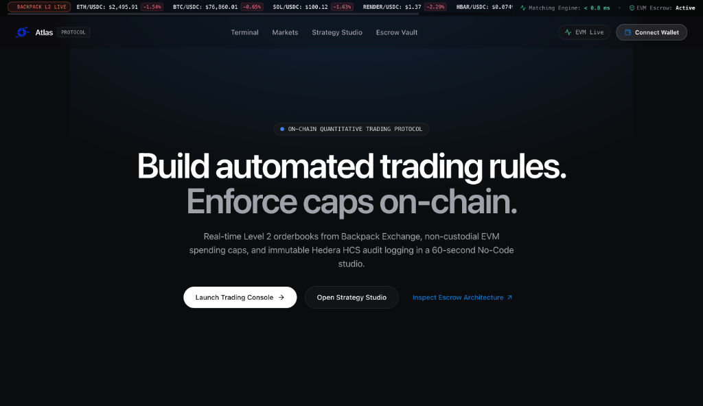
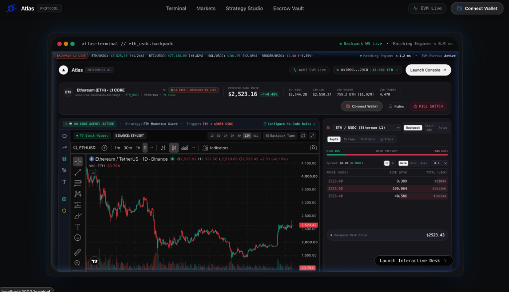
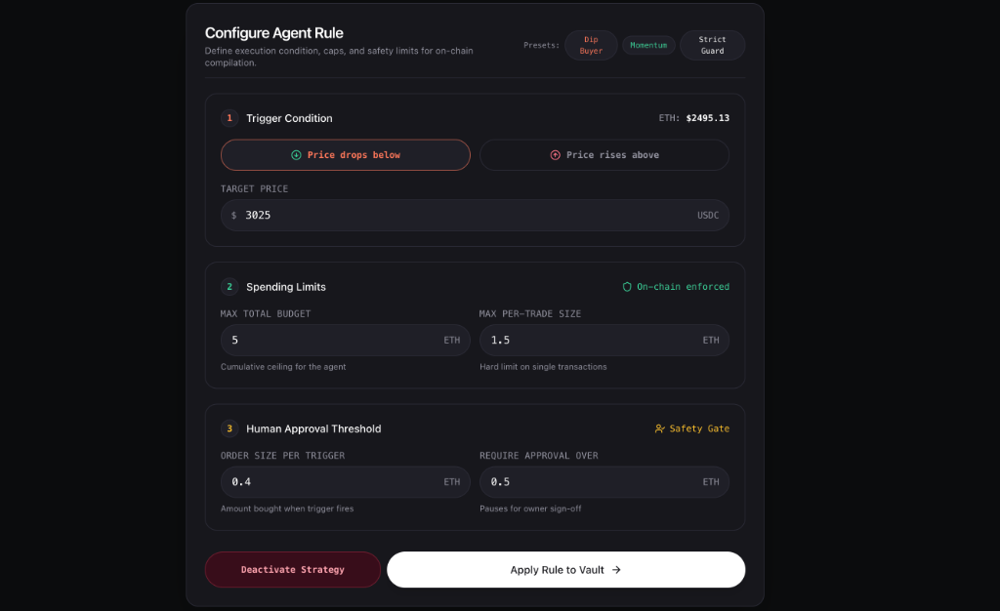
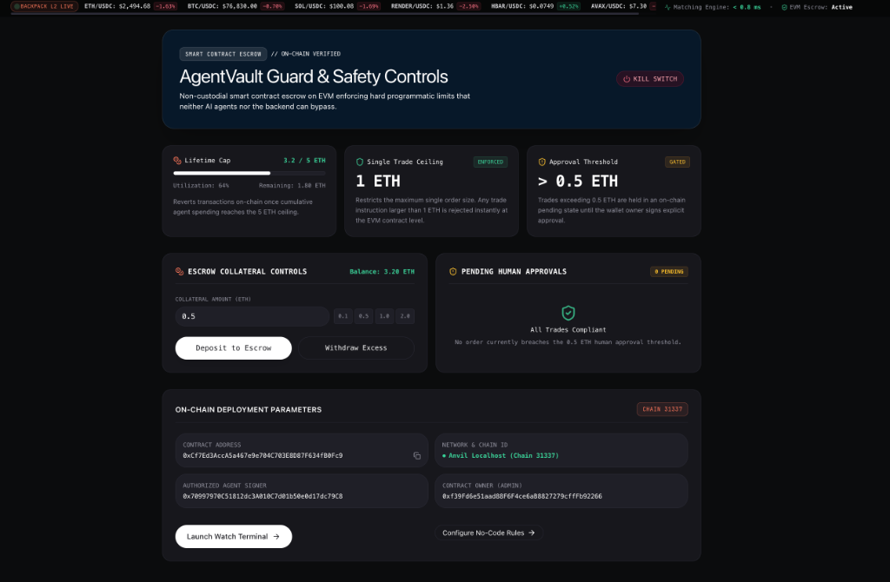

# Atlas: Enterprise Quantitative AI Protocol & Guarded Escrow

<p align="center">
  
</p>

Atlas is an enterprise-grade autonomous quantitative trading agent platform. Users configure algorithmic trading logic through a **No-Code Visual Rule Builder**, enforce strict **programmatic spending ceilings and human-in-the-loop approval gates on-chain**, and monitor trade execution against a **TradingView Pro live orderbook and chart**.

Every strategy execution, guardrail block, and emergency kill-switch event is logged immutably onto **Hedera Consensus Service (HCS)** with full EVM smart contract enforcement on **AgentVault.sol**.

---

## 📸 Interface & Product Walkthrough

### Landing Hero & Core Engine
Build automated trading rules and enforce non-custodial EVM spending caps with real-time Level 2 orderbook feeds from Backpack Exchange.



---

### Pro Trading Terminal (TradingView & Backpack Orderbook)
Features real-time WebSocket orderbook depth ladder streaming (`wss://ws.backpack.exchange`), customizable TradingView charting, active strategy monitors, and quick wallet activation.



---

### No-Code Strategy Studio
Visually configure rule trigger conditions, target asset price levels, cumulative budget ceilings, per-trade spending caps, and human-in-the-loop sign-off thresholds.



---

### Non-Custodial AgentVault & Safety Controls
On-chain contract security dashboard enforcing hard programmatic limits that neither AI agents nor backend services can bypass, complete with instant Emergency Kill-Switch and deposit/withdrawal escrow controls.



---

## Key Features & Architecture

- **TradingView Pro Trading Console**: Real-time order book depth ladder streaming live via WebSocket (`wss://ws.backpack.exchange`), custom drawing palette, and interactive trade execution markers.
- **No-Code Strategy Studio**: Visually configure execution conditions (Dip Buyer, Momentum, Strict Guard), per-trade caps, lifetime ceilings, and human-in-the-loop threshold sign-offs.
- **Guarded Non-Custodial EVM Escrow (`AgentVault.sol`)**:
  - `maxPerTradeCap`: Hard limit on single-trade size on-chain.
  - `maxLifetimeBudget`: Cumulative spending ceiling enforced on-chain.
  - `requireApprovalOver`: Automatically pauses high-value trades for human signature.
  - `triggerKillSwitch`: Emergency 100% instant refund of escrowed assets to vault owner.
- **Hedera HCS Immutable Audit Trail**: Every trade execution, guardrail block, and kill-switch activation generates a tamper-proof Hedera Consensus Topic message linked to HashScan.
- **ENSv2 Resolution (`alpha.atlas.eth`)**: Resolves protocol vaults, agent nodes, and owner identities using ENSv2 client resolution.
- **x402 Micro-Fee AI Inference**: Agent pays micro-fees in USDC/HBAR per AI signal request via HTTP 402 payment headers.

---

## System Architecture

```text
┌────────────────────────────────────────────────────────┐
│               Next.js Trading Terminal                 │
│  - No-Code Visual Rule Builder & TradingView Pro UI    │
│  - Real-Time Backpack Exchange Orderbook Depth Ladder │
│  - Live Ticker Bar & Interactive Execution Markers     │
│  - Human Approval Modal & Emergency Kill-Switch       │
└───────────────────▲───────────────┬────────────────────┘
                    │ WebSocket /   │ Deploy /
                    │ Contract Logs │ Escrow Funds
                    │               ▼
┌───────────────────┴───────────────┐   ┌───────────────────────────────┐
│     Autonomous Agent Runner       │   │       AgentVault.sol          │
│  - Binance & Backpack WS Feed     ├───►  - Non-Custodial Escrow Storage│
│  - JSON Schema Execution Engine   │   │  - Max Lifetime Total Ceiling │
│  - Viem On-Chain Trade Dispatcher │   │  - Max Single-Trade Cap       │
│  - Hedera HCS Audit Log Publisher │   │  - Human Approval Threshold   │
└───────────────────────────────────┘   │  - Instant Refund Kill-Switch │
                                        └───────────────────────────────┘
```

---

## Quickstart Guide

### 1. Prerequisites
- **Node.js**: `v18+` (Tested on Node 20 / 24)
- **Foundry**: `forge` and `anvil`

### 2. Install Dependencies
```bash
# In project root
npm install

# Build agent runner and frontend
cd agent-runner && npm install && npm run build && cd ..
cd frontend && npm install && cd ..
```

### 3. Run Smart Contract Test Suite
Run the Foundry test suite (verifying caps, threshold approvals, and instant refund kill-switch):
```bash
cd contracts
forge test -vvv
```

### 4. Start Full Stack

```bash
# Terminal 1: Start Agent Runner Backend (Port 3001)
cd agent-runner && npm run dev

# Terminal 2: Start Next.js Trading Terminal (Port 3000)
cd frontend && npm run dev
```

Open [http://localhost:3000/terminal](http://localhost:3000/terminal) in your browser.

---

## Repository Structure

```text
atlas/
├── agent-runner/        # Node.js TypeScript autonomous execution engine & HCS publisher
├── contracts/           # Solidity smart contracts (AgentVault.sol) & Foundry test suite
├── docs/                # Architecture documentation & screenshots
│   └── images/          # Screenshots for README and documentation
├── frontend/            # Next.js 14 app, TradingView UI, Backpack orderbook, Viem integration
│   ├── app/             # App router pages (/terminal, /vault, /markets, /automation)
│   ├── components/      # UI components (TradingTerminal, RuleBuilder, LiveTickerBar, etc.)
│   ├── context/         # Unified WalletProvider React context
│   ├── hooks/           # Real-time WebSocket and contract event hooks
│   └── lib/             # Crypto assets registry, ENSv2 client, Hedera HCS client
└── orderBook.md         # Protocol orderbook specifications & architecture notes
```

---

## License
MIT © 2026 Atlas Protocol
