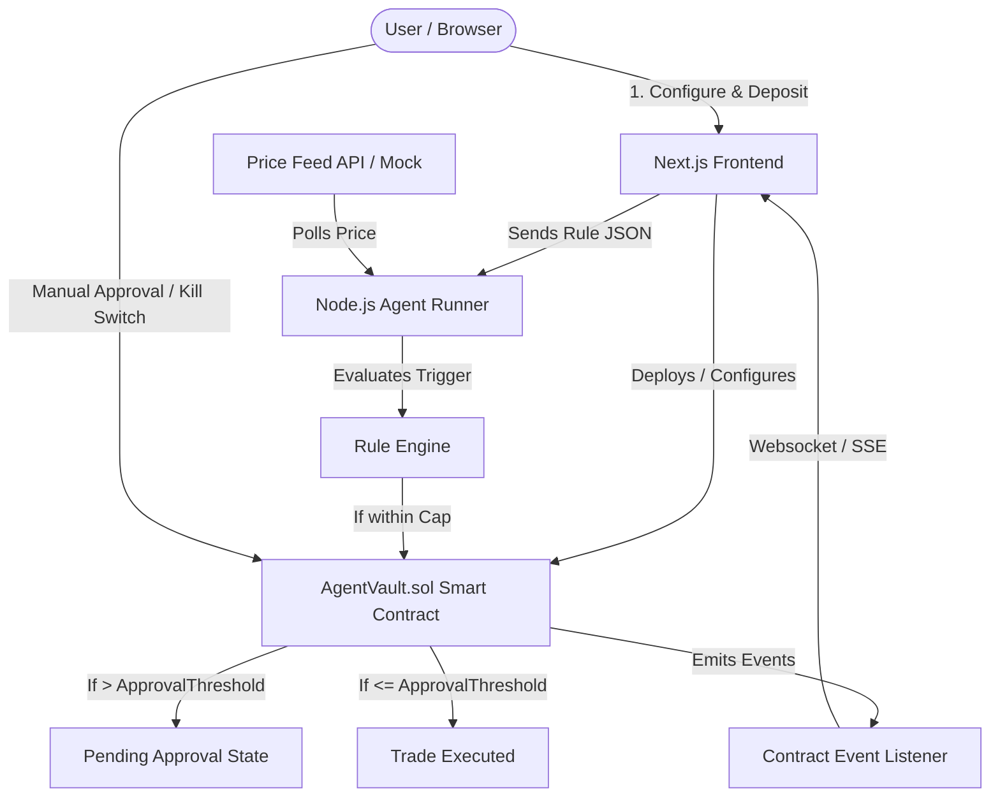

# Implementation Plan: Scaffold No-Code AI Trading Agent with Live Order Book (`agent-finance-nocode`)

Build an autonomous trading agent platform with a **no-code rule builder**, on-chain **escrow vault with hard spending caps, approval thresholds, and kill switch**, an autonomous **Node.js execution runner**, and a **Next.js live trading dashboard** with real-time charts and order book.

## Architecture Overview



---

## User Review Required

> [!IMPORTANT]
> **Single Pair & Live Order Book Source:**
> As specified in the brief's explicit hackathon cuts:
> - Asset pair: **ETH/USDC**
> - Order book feed: Binance public WebSocket/REST for ETH/USDC (real-time live order book and tick data, no API key needed) with an automatic offline fallback mock feed for zero-friction local demos.
> - Blockchain target: Local Foundry Anvil (immediate zero-gas testing) and configurable RPC for Sepolia testnet.

---

## Proposed Changes

We will scaffold the project directly in the workspace root with standard monorepo structure:

### 1. Shared Types & Schema (`shared/`)

#### [NEW] [agentConfig.ts](shared/types/agentConfig.ts)
- Define TypeScript interfaces:
  - `TriggerCondition`: type (`PRICE_BELOW` | `PRICE_ABOVE`), targetPrice, asset
  - `SpendingCap`: maxTotalSpend, maxPerTradeSpend, currentTotalSpend
  - `ApprovalThreshold`: thresholdAmount
  - `AgentConfig`: complete JSON specification combining Trigger, Cap, Approval, and Target Pair
  - `TradeEvent`: payloads for `Attempted`, `Executed`, `PendingApproval`, `Rejected`, `KillSwitch`

#### [NEW] [agent-config.schema.json](agent-runner/config/agent-config.schema.json)
- JSON Schema definition conforming to `AgentConfig` for validation in both runner and frontend.

---

### 2. Smart Contracts (`contracts/` - Foundry)

#### [NEW] [foundry.toml](contracts/foundry.toml)
- Foundry configuration with optimizer settings and remap paths.

#### [NEW] [IPriceFeed.sol](contracts/src/interfaces/IPriceFeed.sol)
- Interface for Chainlink / mock price feeds (`getLatestPrice()`, `decimals()`).

#### [NEW] [MockPriceFeed.sol](contracts/src/MockPriceFeed.sol)
- Controllable mock price feed for deterministic testing and demo scenarios.

#### [NEW] [AgentVault.sol](contracts/src/AgentVault.sol)
- Escrow vault holding native ETH and ERC20 tokens.
- **On-chain policy enforcement:**
  - `maxTotalSpend` (global cumulative ceiling)
  - `maxPerTradeSpend` (single trade limit)
  - `approvalThreshold` (trade amount above which human approval is required)
  - `isKilled` (emergency kill switch state)
- **Functions:**
  - `deposit()`: Owner deposits funds into escrow.
  - `setAgentConfig(uint256 _maxTotalSpend, uint256 _maxPerTradeSpend, uint256 _approvalThreshold, address _agent)`: Sets rule parameters on-chain.
  - `executeTrade(uint256 amount, uint256 price, bytes calldata tradeData)`: Agent entrypoint; verifies limits; if amount > threshold, creates pending trade request; if within limits, executes trade.
  - `approveTrade(uint256 tradeId)`: Owner confirms a pending high-value trade.
  - `rejectTrade(uint256 tradeId)`: Owner cancels a pending trade.
  - `killSwitch()`: Owner emergency halt; flips `isKilled = true`, rejects pending trades, refunds all escrow balance immediately to owner.
- **Events:**
  - `AgentConfigUpdated(...)`
  - `TradeAttempted(...)`
  - `TradeExecuted(...)`
  - `TradePendingApproval(...)`
  - `TradeApproved(...)`
  - `TradeRejected(...)`
  - `KillSwitchTriggered(...)`

#### [NEW] Unit & Integration Tests:
- [AgentVault.t.sol](contracts/test/AgentVault.t.sol) - Base deposit, config, and authorized callers.
- [CapEnforcement.t.sol](contracts/test/CapEnforcement.t.sol) - Ensures per-trade and total spending caps cannot be exceeded.
- [ApprovalFlow.t.sol](contracts/test/ApprovalFlow.t.sol) - Tests trade pausing above threshold and subsequent owner execution.
- [KillSwitch.t.sol](contracts/test/KillSwitch.t.sol) - Verifies instant agent lockout and 100% escrow balance return to owner.

#### [NEW] [Deploy.s.sol](contracts/script/Deploy.s.sol)
- Deployment script deploying `MockPriceFeed` and `AgentVault`.

---

### 3. Agent Runner Backend (`agent-runner/`)

#### [NEW] [package.json](agent-runner/package.json) & [tsconfig.json](agent-runner/tsconfig.json)
- Express, WebSocket (`ws`), `viem` / `ethers`, `dotenv`, `zod`.

#### [NEW] [priceFeed.ts](agent-runner/src/priceFeed.ts)
- Live price watcher supporting:
  - Real-time Binance ETH/USDC ticker stream.
  - Interactive mock control mode (allows pushing custom prices via REST API to trigger trades on demand for the hackathon demo!).

#### [NEW] [ruleEngine.ts](agent-runner/src/ruleEngine.ts)
- Evaluates active JSON rules against the incoming price tick.
- Checks if trigger condition (`PRICE_BELOW` or `PRICE_ABOVE`) is met and triggers execution.

#### [NEW] [contractClient.ts](agent-runner/src/contractClient.ts)
- Interacts with `AgentVault` contract using `viem` with agent wallet. Calls `executeTrade`.

#### [NEW] [eventListener.ts](agent-runner/src/eventListener.ts)
- Listens to contract events and broadcasts them to connected frontend clients over WebSocket.

#### [NEW] [index.ts](agent-runner/src/index.ts)
- Entry point initializing price feed polling, rule engine loop, HTTP API for config updates, and WS server.

---

### 4. Frontend Application (`frontend/`)

#### [NEW] Next.js 14+ App Setup with Tailwind CSS, Lucide icons, `lightweight-charts`, `wagmi`/`viem`.

#### [NEW] [app/page.tsx](frontend/app/page.tsx)
- Landing page introducing the autonomous agent, active stats, and quick-start button to the builder or dashboard.

#### [NEW] [app/builder/page.tsx](frontend/app/builder/page.tsx)
- 60-second no-code visual builder:
  - **TriggerInput**: Select condition ("Price drops below" or "Price rises above") & threshold price.
  - **CapInput**: Total spend cap & max per-trade limit.
  - **ApprovalThresholdInput**: Trade size requiring manual approval.
  - **Live JSON Preview**: Real-time syntax-highlighted display of the rule JSON.
  - **Deploy & Escrow Button**: Submits on-chain config and loads dashboard.

#### [NEW] [app/dashboard/page.tsx](frontend/app/dashboard/page.tsx)
- Unified command center containing:
  - **PriceChart**: TradingView `lightweight-charts` with real-time candlestick/line chart.
  - **AgentTradeMarker**: Visually overlays agent trades (buy pins, pending flags) right on the chart.
  - **OrderBookTable**: Real-time bid/ask depth ladder with volume bars.
  - **KillSwitchButton**: Prominent emergency stop button with instant status feedback.
  - **ApprovalModal**: Modal or slide-over to review and click "Approve Trade" for pending trades.
  - **Event Stream / Activity Log**: Live feed of `TradeAttempted`, `Executed`, `Rejected`, and `KillSwitch` events.
  - **Manual Trigger Simulator**: Handy demo toolbar to nudge price up or down to showcase live triggering.

#### [NEW] Hooks & Utilities:
- [useContractEvents.ts](frontend/hooks/useContractEvents.ts): WS connection to backend/contract events.
- [useOrderBook.ts](frontend/hooks/useOrderBook.ts): Live order book data hook.
- [contractAbi.ts](frontend/lib/contractAbi.ts) & [contractAddress.ts](frontend/lib/contractAddress.ts): Contract bindings.

---

### 5. Root Configuration & Documentation

#### [NEW] [package.json](package.json)
- Monorepo script orchestration (`npm run dev` boots runner & frontend concurrently).

#### [NEW] [.env.example](.env.example)
- Complete environment variable template with defaults for local Anvil and testnet.

#### [NEW] [README.md](README.md)
- Complete setup instructions and the 5-step live demo script.

---

## Verification Plan

### Automated Tests
1. **Foundry Contracts:**
   ```bash
   cd contracts && forge test -vvv
   ```
   Validates:
   - Base escrow deposit and withdrawal
   - Hard cap enforcement (rejection if per-trade or total limit exceeded)
   - Approval threshold flow (pending trade creation, owner approval & execution)
   - Kill switch (immediate lockout, 100% refund)

2. **Frontend & Runner Build Verification:**
   ```bash
   cd agent-runner && npm run build
   cd frontend && npm run build
   ```

### Manual Verification
- Walk through the 5-step demo script:
  1. Configure rule in builder in < 30s.
  2. Nudge price past trigger -> verify agent executes trade and marker appears on chart.
  3. Trigger trade exceeding approval threshold -> verify pending approval modal opens, approve it, verify execution.
  4. Hit the kill-switch -> verify agent halts and escrow balance is returned.
