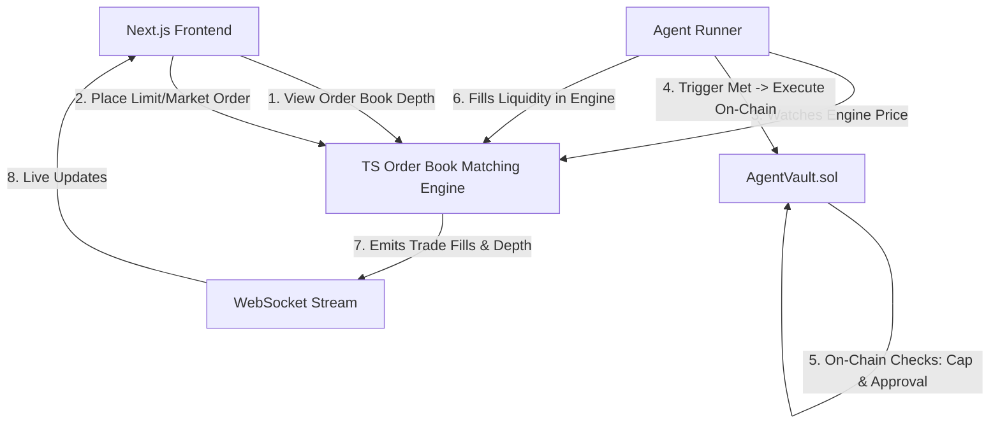

Integrating a dedicated, high-performance **Order Book Matching Engine** in TypeScript (replacing external Binance polling with our own self-contained matching engine) while keeping the on-chain Solidity vault escrow, spending cap enforcement, and Next.js frontend.

---

## Architecture Overview



---

## User Review Required

> [!IMPORTANT]
> **Matching Engine Implementation in TypeScript**:
> - Replaces external Binance polling with a complete in-memory **Order Book Matching Engine** (price-time priority matching for `LIMIT` and `MARKET` orders, depth aggregation, and trade execution fills).
> - Pre-seeds initial liquidity (bids and asks around ETH/USDC market price) so the order book is fully populated and alive immediately upon startup.
> - Directly links the autonomous agent's trade execution to the matching engine: when `AgentVault.sol` executes a trade, it fills against the best available asks on the order book, moving the market price dynamically.

---

## Proposed Changes

### 1. Matching Engine Core (`agent-runner/src/orderbook/`)

#### [NEW] [types.ts](agent-runner/src/orderbook/types.ts)
- Define `Order`, `OrderSide` (`BUY` | `SELL`), `OrderType` (`LIMIT` | `MARKET`), `Fill`, `OrderBookLevel`, and `MarketDepth`.

#### [NEW] [matchingEngine.ts](agent-runner/src/orderbook/matchingEngine.ts)
- `OrderBook` class:
  - Price-time priority queues using sorted price level maps for `bids` (descending) and `asks` (ascending).
  - `createOrder(order)`: matches incoming orders against opposite book; executes fills; adds remaining volume to the book if limit order.
  - `cancelOrder(orderId)`: removes pending order from book.
  - `getDepth(levels)`: calculates cumulative liquidity depth for UI ladder.
  - `getTrades(limit)`: recent trade execution history.
  - Initial liquidity seeder (generates realistic active market maker orders).

---

### 2. Agent Runner Integration (`agent-runner/src/`)

#### [MODIFY] [priceFeed.ts](agent-runner/src/priceFeed.ts)
- Switch price feed to source prices directly from the `OrderBook` matching engine's latest matched trades, with periodic synthetic market-making updates.

#### [MODIFY] [ruleEngine.ts](agent-runner/src/ruleEngine.ts)
- When trigger fires:
  1. Calls `contractClient.submitTrade()` to verify on-chain caps and escrow.
  2. Submits market order to `matchingEngine` to consume real liquidity.

#### [MODIFY] [index.ts](agent-runner/src/index.ts)
- Expose REST API endpoints:
  - `GET /api/orderbook`: Returns real matching engine depth.
  - `POST /api/orderbook/order`: Place custom limit/market order.
  - `POST /api/orderbook/cancel`: Cancel order.
  - `GET /api/orderbook/trades`: Returns executed fills.
- Broadcast depth and trade fills over WebSocket.

---

### 3. Frontend Enhancements (`frontend/`)

#### [MODIFY] [OrderBookTable.tsx](frontend/components/OrderBook/OrderBookTable.tsx)
- Add interactive "Place Order" toggle tab:
  - Select Side (`BUY` / `SELL`)
  - Set Price & Quantity
  - Submit order directly to matching engine
- Visual indicator when an agent trade matches against the order book.

---

## Verification Plan

### Automated Tests
1. **Order Book Unit Tests:**
   Create unit tests `agent-runner/tests/matchingEngine.test.ts`:
   - Limit order insertion and book ordering.
   - Partial fills and full fills.
   - Market order liquidity execution.
   - Cancelling orders.
2. **Build Verification:**
   ```bash
   cd agent-runner && npm run build
   cd frontend && npm run build
   ```

### Live End-to-End Verification
1. Verify order book depth loads with real orders from the matching engine.
2. Place a limit ask at $3,040 via the UI / API.
3. Observe agent trigger when price drops below condition, buying against that exact ask and clearing the level.
